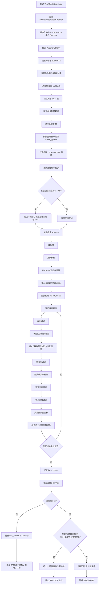

# BlackSearch 识别处理链路

## 说明

- 相机输入来自 [camera.py](/home/wrf/Desktop/25e/25etest/Drivers/camera.py)，识别主流程在 [BlackSearch.py](/home/wrf/Desktop/25e/25etest/Test/BlackSearch.py)。
- 处理线程只消费“最新帧”，这是为了降低延迟，不追旧画面。
- ROI 裁剪用于减少整帧扫描开销，提高实时性。
- 候选目标的关键判定条件是：近似矩形、存在内孔洞、中心区域足够黑。
- 当目标短暂丢失时，程序不会立刻判定失败，而是先按上一帧速度做几帧预测。
