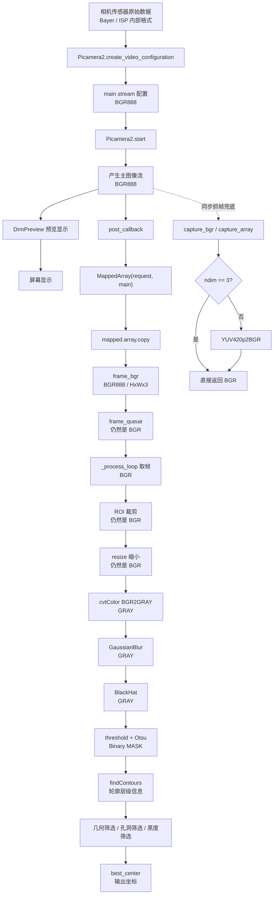

# BlackSearch 图像格式链路

这份文档专门说明 `BlackSearch` 在视频采集、预览显示和识别处理过程中，各阶段使用的图像格式 / 颜色空间。

## 总链路图



## 关键说明

- 在 [camera.py](/home/wrf/Desktop/25e/25etest/Drivers/camera.py) 中，`main={"size": self.main_size, "format": "BGR888"}` 是当前主链路格式的核心声明。
- 这张图现在表达的是“先采集，再分流”：
  - 一路去 `DrmPreview` 做显示
  - 一路去 `post_callback` 进入识别
- 识别主链路真正的格式变化可以概括为：

```text
BGR888 -> BGR(ROI/resize后仍是BGR) -> GRAY -> GRAY(blur/blackhat后仍是GRAY) -> Binary MASK -> Contours -> 坐标
```

- `DrmPreview` 所在的显示链路是“看画面”的链路，不是识别输入链路。
- `capture_bgr()` 是一个同步抓帧兜底接口。当前 `BGR888` 配置下一般直接返回 `BGR`；如果未来相机格式改成 `YUV420`，则会在这里补一次 `YUV420p -> BGR` 转换。

## 识别链路中的格式变化解释

- `frame_bgr`
  来源于 `post_callback -> MappedArray -> copy`，格式是 `BGR888`
- `ROI 裁剪`
  只改变图像空间范围，不改变颜色空间，结果仍然是 `BGR`
- `resize`
  只改变分辨率，不改变颜色空间，结果仍然是 `BGR`
- `BGR2GRAY`
  从三通道彩色图转换成单通道灰度图
- `GaussianBlur`
  仍然是灰度图，只是做平滑去噪
- `BlackHat`
  仍然是灰度图，用于增强亮背景中的暗结构
- `threshold + Otsu`
  输出二值 `MASK`，像素基本为 `0/255`
- `findContours`
  从二值图中提取轮廓与父子层级，之后处理重点就不再是颜色空间，而是几何结构
