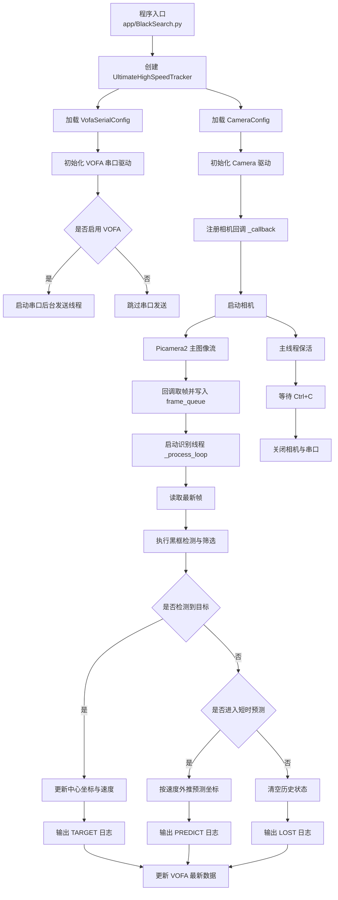

# 主程序设计框图

## 1. 说明

本图描述当前工程的主程序结构、模块关系与运行时数据流。

## 2. 主程序结构图

## 3. 模块职责

### 3.1 应用层

[BlackSearch.py](/home/wrf/Desktop/25e/25etest/app/BlackSearch.py)

负责：

- 程序入口
- 相机配置与串口配置装配
- 识别流程控制
- 目标跟踪与预测
- 日志输出

### 3.2 相机驱动层

[camera.py](/home/wrf/Desktop/25e/25etest/Drivers/camera.py)

负责：

- 相机初始化
- 主图像流配置
- 3A / 手动曝光控制
- 预览显示
- 回调取帧

### 3.3 串口驱动层

[vofa_serial.py](/home/wrf/Desktop/25e/25etest/Drivers/vofa_serial.py)

负责：

- 串口初始化
- 后台定频发送
- 最新数据缓存
- 面向 VOFA+ 的文本格式输出

## 4. 运行特点

- 主线程负责生命周期管理
- 相机回调线程负责生产最新图像帧
- 识别线程负责消费图像帧并输出目标结果
- 串口发送线程负责低频发送最新数值数据

## 5. 说明

当前主程序采用“驱动层与应用层分离”的结构：

- 驱动层负责采集、控制、预览、串口发送
- 应用层负责识别逻辑与业务处理

该结构便于后续复用相机驱动与串口驱动，并降低不同任务之间的耦合度。
